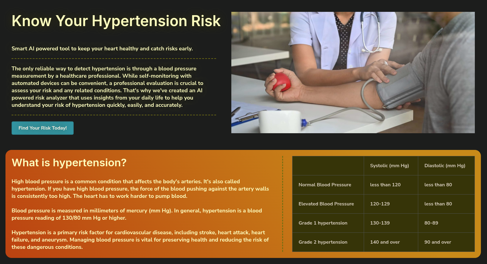
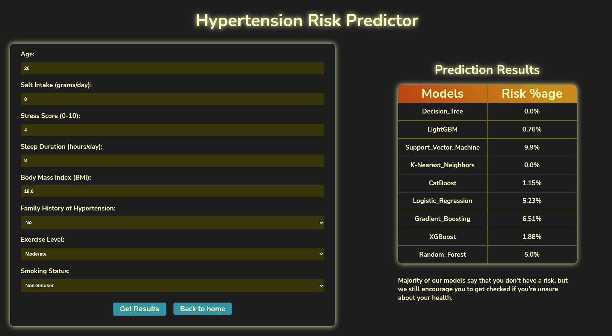

# Hypertension Risk Detection Web App

## Overview

This project is a web based application designed to predict the risk of hypertension based on users daily lifestyle inputs.
It is intended for health conscious individuals who want an initial assessment of their potential hypertension risk.

> **Disclaimer:** This tool is not a medical diagnosis. If you have health concerns, please consult a qualified healthcare professional for proper evaluation.

---

## Website Design

